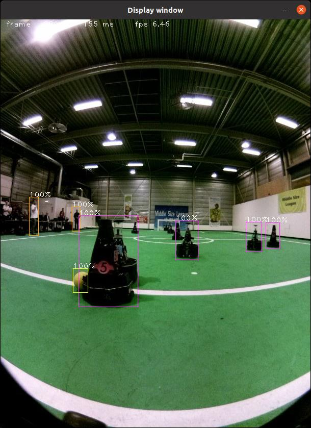

## Detector with libdarknet.so
Extreme simple .cpp detector to demonstrate use of darknet/YOLO in custom application

Based on darket test_detector and functions

* compiles against libdarknet.so
* makes use of the config files of https://github.com/andrepool/robocup_ml.git
* make use of weights file https://drive.google.com/file/d/12-D5W1UotDhShUEjGuipH3R7uE9YL4zq/view?usp=sharing
* tested on Ubuntu 20.04
* requires opencv4
* tested with cuda-11.1


## Howto
* compile darknet with LIBSO=1
* sudo cp libdarknet.so /usr/local/lib
* sudo cp include/darknet.h /usr/local/include
* git clone https://github.com/andrepool/robocup_ml.git ~/robocup_ml
* git clone https://github.com/andrepool/detect_with_darknet.git ~/detect_with_darknet
* cd ~/detect_with_darknet
* fileid="12-D5W1UotDhShUEjGuipH3R7uE9YL4zq"
* curl -c ./cookie -s -L "https://drive.google.com/uc?export=download&id=${fileid}" > /dev/null
* curl -Lb ./cookie "https://drive.google.com/uc?export=download&confirm=`awk '/download/ {print $NF}' ./cookie`&id=${fileid}" -o yolov4_final.weights
* make


tested with darknet version

```
commit 795474f0ed022fd73af4e70cac79751f672d8af9 (HEAD -> master, origin/master, origin/HEAD)
Merge: 46dea82 070ed01
Author: AlexeyAB <kikots@mail.ru>
Date:   Tue Jun 22 00:31:53 2021 +0300

    Merge branch 'master' of https://github.com/AlexeyAB/darknet
```

Expected image




Expected log

```
g++ -g3 -Ofast -m64 -ansi -std=c++11 -Wall -Wextra -Wpedantic -Werror -Wfatal-errors -I/usr/include/opencv4 -I/usr/local/cuda/include -o detect_with_darknet.o -c detect_with_darknet.cpp
g++ -std=c++11 -lcuda -lcudart -lcublas -lcurand -lcudnn -L/usr/local/cuda/lib64 -o detect_with_darknet detect_with_darknet.o -lstdc++ -lrt -ldarknet -lopencv_core -lopencv_imgproc -lopencv_highgui -lopencv_imgcodecs
INFO   stand alone darknet detector
 Try to load cfg: ../robocup_ml/yolov4.cfg, weights: ./yolov4_final.weights, clear = 1 
 0 : compute_capability = 500, cudnn_half = 0, GPU: Quadro M2000M 
net.optimized_memory = 0 
mini_batch = 1, batch = 1, time_steps = 1, train = 0 
   layer   filters  size/strd(dil)      input                output
   0 Create CUDA-stream - 0 
 Create cudnn-handle 0 
conv     32       3 x 3/ 1    416 x 416 x   3 ->  416 x 416 x  32 0.299 BF
   1 conv     64       3 x 3/ 2    416 x 416 x  32 ->  208 x 208 x  64 1.595 BF
   2 conv     64       1 x 1/ 1    208 x 208 x  64 ->  208 x 208 x  64 0.354 BF
   3 route  1                                      ->  208 x 208 x  64 
   4 conv     64       1 x 1/ 1    208 x 208 x  64 ->  208 x 208 x  64 0.354 BF
   5 conv     32       1 x 1/ 1    208 x 208 x  64 ->  208 x 208 x  32 0.177 BF
   6 conv     64       3 x 3/ 1    208 x 208 x  32 ->  208 x 208 x  64 1.595 BF
   7 Shortcut Layer: 4,  wt = 0, wn = 0, outputs: 208 x 208 x  64 0.003 BF
   8 conv     64       1 x 1/ 1    208 x 208 x  64 ->  208 x 208 x  64 0.354 BF
   9 route  8 2                                    ->  208 x 208 x 128 
  10 conv     64       1 x 1/ 1    208 x 208 x 128 ->  208 x 208 x  64 0.709 BF
  11 conv    128       3 x 3/ 2    208 x 208 x  64 ->  104 x 104 x 128 1.595 BF
  12 conv     64       1 x 1/ 1    104 x 104 x 128 ->  104 x 104 x  64 0.177 BF
  13 route  11                                     ->  104 x 104 x 128 
  14 conv     64       1 x 1/ 1    104 x 104 x 128 ->  104 x 104 x  64 0.177 BF
  15 conv     64       1 x 1/ 1    104 x 104 x  64 ->  104 x 104 x  64 0.089 BF
  16 conv     64       3 x 3/ 1    104 x 104 x  64 ->  104 x 104 x  64 0.797 BF
  17 Shortcut Layer: 14,  wt = 0, wn = 0, outputs: 104 x 104 x  64 0.001 BF
  18 conv     64       1 x 1/ 1    104 x 104 x  64 ->  104 x 104 x  64 0.089 BF
  19 conv     64       3 x 3/ 1    104 x 104 x  64 ->  104 x 104 x  64 0.797 BF
  20 Shortcut Layer: 17,  wt = 0, wn = 0, outputs: 104 x 104 x  64 0.001 BF
  21 conv     64       1 x 1/ 1    104 x 104 x  64 ->  104 x 104 x  64 0.089 BF
  22 route  21 12                                  ->  104 x 104 x 128 
  23 conv    128       1 x 1/ 1    104 x 104 x 128 ->  104 x 104 x 128 0.354 BF
  24 conv    256       3 x 3/ 2    104 x 104 x 128 ->   52 x  52 x 256 1.595 BF
  25 conv    128       1 x 1/ 1     52 x  52 x 256 ->   52 x  52 x 128 0.177 BF
  26 route  24                                     ->   52 x  52 x 256 
  27 conv    128       1 x 1/ 1     52 x  52 x 256 ->   52 x  52 x 128 0.177 BF
  28 conv    128       1 x 1/ 1     52 x  52 x 128 ->   52 x  52 x 128 0.089 BF
  29 conv    128       3 x 3/ 1     52 x  52 x 128 ->   52 x  52 x 128 0.797 BF
  30 Shortcut Layer: 27,  wt = 0, wn = 0, outputs:  52 x  52 x 128 0.000 BF
  31 conv    128       1 x 1/ 1     52 x  52 x 128 ->   52 x  52 x 128 0.089 BF
  32 conv    128       3 x 3/ 1     52 x  52 x 128 ->   52 x  52 x 128 0.797 BF
  33 Shortcut Layer: 30,  wt = 0, wn = 0, outputs:  52 x  52 x 128 0.000 BF
  34 conv    128       1 x 1/ 1     52 x  52 x 128 ->   52 x  52 x 128 0.089 BF
  35 conv    128       3 x 3/ 1     52 x  52 x 128 ->   52 x  52 x 128 0.797 BF
  36 Shortcut Layer: 33,  wt = 0, wn = 0, outputs:  52 x  52 x 128 0.000 BF
  37 conv    128       1 x 1/ 1     52 x  52 x 128 ->   52 x  52 x 128 0.089 BF
  38 conv    128       3 x 3/ 1     52 x  52 x 128 ->   52 x  52 x 128 0.797 BF
  39 Shortcut Layer: 36,  wt = 0, wn = 0, outputs:  52 x  52 x 128 0.000 BF
  40 conv    128       1 x 1/ 1     52 x  52 x 128 ->   52 x  52 x 128 0.089 BF
  41 conv    128       3 x 3/ 1     52 x  52 x 128 ->   52 x  52 x 128 0.797 BF
  42 Shortcut Layer: 39,  wt = 0, wn = 0, outputs:  52 x  52 x 128 0.000 BF
  43 conv    128       1 x 1/ 1     52 x  52 x 128 ->   52 x  52 x 128 0.089 BF
  44 conv    128       3 x 3/ 1     52 x  52 x 128 ->   52 x  52 x 128 0.797 BF
  45 Shortcut Layer: 42,  wt = 0, wn = 0, outputs:  52 x  52 x 128 0.000 BF
  46 conv    128       1 x 1/ 1     52 x  52 x 128 ->   52 x  52 x 128 0.089 BF
  47 conv    128       3 x 3/ 1     52 x  52 x 128 ->   52 x  52 x 128 0.797 BF
  48 Shortcut Layer: 45,  wt = 0, wn = 0, outputs:  52 x  52 x 128 0.000 BF
  49 conv    128       1 x 1/ 1     52 x  52 x 128 ->   52 x  52 x 128 0.089 BF
  50 conv    128       3 x 3/ 1     52 x  52 x 128 ->   52 x  52 x 128 0.797 BF
  51 Shortcut Layer: 48,  wt = 0, wn = 0, outputs:  52 x  52 x 128 0.000 BF
  52 conv    128       1 x 1/ 1     52 x  52 x 128 ->   52 x  52 x 128 0.089 BF
  53 route  52 25                                  ->   52 x  52 x 256 
  54 conv    256       1 x 1/ 1     52 x  52 x 256 ->   52 x  52 x 256 0.354 BF
  55 conv    512       3 x 3/ 2     52 x  52 x 256 ->   26 x  26 x 512 1.595 BF
  56 conv    256       1 x 1/ 1     26 x  26 x 512 ->   26 x  26 x 256 0.177 BF
  57 route  55                                     ->   26 x  26 x 512 
  58 conv    256       1 x 1/ 1     26 x  26 x 512 ->   26 x  26 x 256 0.177 BF
  59 conv    256       1 x 1/ 1     26 x  26 x 256 ->   26 x  26 x 256 0.089 BF
  60 conv    256       3 x 3/ 1     26 x  26 x 256 ->   26 x  26 x 256 0.797 BF
  61 Shortcut Layer: 58,  wt = 0, wn = 0, outputs:  26 x  26 x 256 0.000 BF
  62 conv    256       1 x 1/ 1     26 x  26 x 256 ->   26 x  26 x 256 0.089 BF
  63 conv    256       3 x 3/ 1     26 x  26 x 256 ->   26 x  26 x 256 0.797 BF
  64 Shortcut Layer: 61,  wt = 0, wn = 0, outputs:  26 x  26 x 256 0.000 BF
  65 conv    256       1 x 1/ 1     26 x  26 x 256 ->   26 x  26 x 256 0.089 BF
  66 conv    256       3 x 3/ 1     26 x  26 x 256 ->   26 x  26 x 256 0.797 BF
  67 Shortcut Layer: 64,  wt = 0, wn = 0, outputs:  26 x  26 x 256 0.000 BF
  68 conv    256       1 x 1/ 1     26 x  26 x 256 ->   26 x  26 x 256 0.089 BF
  69 conv    256       3 x 3/ 1     26 x  26 x 256 ->   26 x  26 x 256 0.797 BF
  70 Shortcut Layer: 67,  wt = 0, wn = 0, outputs:  26 x  26 x 256 0.000 BF
  71 conv    256       1 x 1/ 1     26 x  26 x 256 ->   26 x  26 x 256 0.089 BF
  72 conv    256       3 x 3/ 1     26 x  26 x 256 ->   26 x  26 x 256 0.797 BF
  73 Shortcut Layer: 70,  wt = 0, wn = 0, outputs:  26 x  26 x 256 0.000 BF
  74 conv    256       1 x 1/ 1     26 x  26 x 256 ->   26 x  26 x 256 0.089 BF
  75 conv    256       3 x 3/ 1     26 x  26 x 256 ->   26 x  26 x 256 0.797 BF
  76 Shortcut Layer: 73,  wt = 0, wn = 0, outputs:  26 x  26 x 256 0.000 BF
  77 conv    256       1 x 1/ 1     26 x  26 x 256 ->   26 x  26 x 256 0.089 BF
  78 conv    256       3 x 3/ 1     26 x  26 x 256 ->   26 x  26 x 256 0.797 BF
  79 Shortcut Layer: 76,  wt = 0, wn = 0, outputs:  26 x  26 x 256 0.000 BF
  80 conv    256       1 x 1/ 1     26 x  26 x 256 ->   26 x  26 x 256 0.089 BF
  81 conv    256       3 x 3/ 1     26 x  26 x 256 ->   26 x  26 x 256 0.797 BF
  82 Shortcut Layer: 79,  wt = 0, wn = 0, outputs:  26 x  26 x 256 0.000 BF
  83 conv    256       1 x 1/ 1     26 x  26 x 256 ->   26 x  26 x 256 0.089 BF
  84 route  83 56                                  ->   26 x  26 x 512 
  85 conv    512       1 x 1/ 1     26 x  26 x 512 ->   26 x  26 x 512 0.354 BF
  86 conv   1024       3 x 3/ 2     26 x  26 x 512 ->   13 x  13 x1024 1.595 BF
  87 conv    512       1 x 1/ 1     13 x  13 x1024 ->   13 x  13 x 512 0.177 BF
  88 route  86                                     ->   13 x  13 x1024 
  89 conv    512       1 x 1/ 1     13 x  13 x1024 ->   13 x  13 x 512 0.177 BF
  90 conv    512       1 x 1/ 1     13 x  13 x 512 ->   13 x  13 x 512 0.089 BF
  91 conv    512       3 x 3/ 1     13 x  13 x 512 ->   13 x  13 x 512 0.797 BF
  92 Shortcut Layer: 89,  wt = 0, wn = 0, outputs:  13 x  13 x 512 0.000 BF
  93 conv    512       1 x 1/ 1     13 x  13 x 512 ->   13 x  13 x 512 0.089 BF
  94 conv    512       3 x 3/ 1     13 x  13 x 512 ->   13 x  13 x 512 0.797 BF
  95 Shortcut Layer: 92,  wt = 0, wn = 0, outputs:  13 x  13 x 512 0.000 BF
  96 conv    512       1 x 1/ 1     13 x  13 x 512 ->   13 x  13 x 512 0.089 BF
  97 conv    512       3 x 3/ 1     13 x  13 x 512 ->   13 x  13 x 512 0.797 BF
  98 Shortcut Layer: 95,  wt = 0, wn = 0, outputs:  13 x  13 x 512 0.000 BF
  99 conv    512       1 x 1/ 1     13 x  13 x 512 ->   13 x  13 x 512 0.089 BF
 100 conv    512       3 x 3/ 1     13 x  13 x 512 ->   13 x  13 x 512 0.797 BF
 101 Shortcut Layer: 98,  wt = 0, wn = 0, outputs:  13 x  13 x 512 0.000 BF
 102 conv    512       1 x 1/ 1     13 x  13 x 512 ->   13 x  13 x 512 0.089 BF
 103 route  102 87                                 ->   13 x  13 x1024 
 104 conv   1024       1 x 1/ 1     13 x  13 x1024 ->   13 x  13 x1024 0.354 BF
 105 conv    512       1 x 1/ 1     13 x  13 x1024 ->   13 x  13 x 512 0.177 BF
 106 conv   1024       3 x 3/ 1     13 x  13 x 512 ->   13 x  13 x1024 1.595 BF
 107 conv    512       1 x 1/ 1     13 x  13 x1024 ->   13 x  13 x 512 0.177 BF
 108 max                5x 5/ 1     13 x  13 x 512 ->   13 x  13 x 512 0.002 BF
 109 route  107                                            ->   13 x  13 x 512 
 110 max                9x 9/ 1     13 x  13 x 512 ->   13 x  13 x 512 0.007 BF
 111 route  107                                            ->   13 x  13 x 512 
 112 max               13x13/ 1     13 x  13 x 512 ->   13 x  13 x 512 0.015 BF
 113 route  112 110 108 107                        ->   13 x  13 x2048 
 114 conv    512       1 x 1/ 1     13 x  13 x2048 ->   13 x  13 x 512 0.354 BF
 115 conv   1024       3 x 3/ 1     13 x  13 x 512 ->   13 x  13 x1024 1.595 BF
 116 conv    512       1 x 1/ 1     13 x  13 x1024 ->   13 x  13 x 512 0.177 BF
 117 conv    256       1 x 1/ 1     13 x  13 x 512 ->   13 x  13 x 256 0.044 BF
 118 upsample                 2x    13 x  13 x 256 ->   26 x  26 x 256
 119 route  85                                     ->   26 x  26 x 512 
 120 conv    256       1 x 1/ 1     26 x  26 x 512 ->   26 x  26 x 256 0.177 BF
 121 route  120 118                                ->   26 x  26 x 512 
 122 conv    256       1 x 1/ 1     26 x  26 x 512 ->   26 x  26 x 256 0.177 BF
 123 conv    512       3 x 3/ 1     26 x  26 x 256 ->   26 x  26 x 512 1.595 BF
 124 conv    256       1 x 1/ 1     26 x  26 x 512 ->   26 x  26 x 256 0.177 BF
 125 conv    512       3 x 3/ 1     26 x  26 x 256 ->   26 x  26 x 512 1.595 BF
 126 conv    256       1 x 1/ 1     26 x  26 x 512 ->   26 x  26 x 256 0.177 BF
 127 conv    128       1 x 1/ 1     26 x  26 x 256 ->   26 x  26 x 128 0.044 BF
 128 upsample                 2x    26 x  26 x 128 ->   52 x  52 x 128
 129 route  54                                     ->   52 x  52 x 256 
 130 conv    128       1 x 1/ 1     52 x  52 x 256 ->   52 x  52 x 128 0.177 BF
 131 route  130 128                                ->   52 x  52 x 256 
 132 conv    128       1 x 1/ 1     52 x  52 x 256 ->   52 x  52 x 128 0.177 BF
 133 conv    256       3 x 3/ 1     52 x  52 x 128 ->   52 x  52 x 256 1.595 BF
 134 conv    128       1 x 1/ 1     52 x  52 x 256 ->   52 x  52 x 128 0.177 BF
 135 conv    256       3 x 3/ 1     52 x  52 x 128 ->   52 x  52 x 256 1.595 BF
 136 conv    128       1 x 1/ 1     52 x  52 x 256 ->   52 x  52 x 128 0.177 BF
 137 conv    256       3 x 3/ 1     52 x  52 x 128 ->   52 x  52 x 256 1.595 BF
 138 conv     30       1 x 1/ 1     52 x  52 x 256 ->   52 x  52 x  30 0.042 BF
 139 yolo
[yolo] params: iou loss: ciou (4), iou_norm: 0.07, obj_norm: 1.00, cls_norm: 1.00, delta_norm: 1.00, scale_x_y: 1.20
nms_kind: greedynms (1), beta = 0.600000 
 140 route  136                                            ->   52 x  52 x 128 
 141 conv    256       3 x 3/ 2     52 x  52 x 128 ->   26 x  26 x 256 0.399 BF
 142 route  141 126                                ->   26 x  26 x 512 
 143 conv    256       1 x 1/ 1     26 x  26 x 512 ->   26 x  26 x 256 0.177 BF
 144 conv    512       3 x 3/ 1     26 x  26 x 256 ->   26 x  26 x 512 1.595 BF
 145 conv    256       1 x 1/ 1     26 x  26 x 512 ->   26 x  26 x 256 0.177 BF
 146 conv    512       3 x 3/ 1     26 x  26 x 256 ->   26 x  26 x 512 1.595 BF
 147 conv    256       1 x 1/ 1     26 x  26 x 512 ->   26 x  26 x 256 0.177 BF
 148 conv    512       3 x 3/ 1     26 x  26 x 256 ->   26 x  26 x 512 1.595 BF
 149 conv     30       1 x 1/ 1     26 x  26 x 512 ->   26 x  26 x  30 0.021 BF
 150 yolo
[yolo] params: iou loss: ciou (4), iou_norm: 0.07, obj_norm: 1.00, cls_norm: 1.00, delta_norm: 1.00, scale_x_y: 1.10
nms_kind: greedynms (1), beta = 0.600000 
 151 route  147                                            ->   26 x  26 x 256 
 152 conv    512       3 x 3/ 2     26 x  26 x 256 ->   13 x  13 x 512 0.399 BF
 153 route  152 116                                ->   13 x  13 x1024 
 154 conv    512       1 x 1/ 1     13 x  13 x1024 ->   13 x  13 x 512 0.177 BF
 155 conv   1024       3 x 3/ 1     13 x  13 x 512 ->   13 x  13 x1024 1.595 BF
 156 conv    512       1 x 1/ 1     13 x  13 x1024 ->   13 x  13 x 512 0.177 BF
 157 conv   1024       3 x 3/ 1     13 x  13 x 512 ->   13 x  13 x1024 1.595 BF
 158 conv    512       1 x 1/ 1     13 x  13 x1024 ->   13 x  13 x 512 0.177 BF
 159 conv   1024       3 x 3/ 1     13 x  13 x 512 ->   13 x  13 x1024 1.595 BF
 160 conv     30       1 x 1/ 1     13 x  13 x1024 ->   13 x  13 x  30 0.010 BF
 161 yolo
[yolo] params: iou loss: ciou (4), iou_norm: 0.07, obj_norm: 1.00, cls_norm: 1.00, delta_norm: 1.00, scale_x_y: 1.05
nms_kind: greedynms (1), beta = 0.600000 
Total BFLOPS 59.592 
avg_outputs = 490304 
 Allocate additional workspace_size = 12.46 MB 
 Try to load weights: ./yolov4_final.weights 
Loading weights from ./yolov4_final.weights...
 seen 64, trained: 3840 K-images (60 Kilo-batches_64) 
Done! Loaded 162 layers from weights-file 
       0 262 c 2 x 0.25 y 0.49 w 0.03 h 0.06 conf 100%
             c 2 x 0.11 y 0.48 w 0.03 h 0.10 conf 100%
             c 1 x 0.60 y 0.54 w 0.07 h 0.10 conf 100%
             c 1 x 0.88 y 0.53 w 0.05 h 0.07 conf 100%
             c 1 x 0.82 y 0.53 w 0.05 h 0.07 conf 100%
             c 1 x 0.35 y 0.59 w 0.19 h 0.23 conf 100%
             c 0 x 0.26 y 0.64 w 0.05 h 0.06 conf 100%
      10 154 c 2 x 0.25 y 0.49 w 0.03 h 0.06 conf 100%
             c 2 x 0.11 y 0.48 w 0.03 h 0.10 conf 100%
             c 1 x 0.60 y 0.54 w 0.07 h 0.10 conf 100%
             c 1 x 0.88 y 0.53 w 0.05 h 0.07 conf 100%
             c 1 x 0.82 y 0.53 w 0.05 h 0.07 conf 100%
             c 1 x 0.35 y 0.59 w 0.19 h 0.23 conf 100%
             c 0 x 0.26 y 0.64 w 0.05 h 0.06 conf 100%
      20 155 c 2 x 0.25 y 0.49 w 0.03 h 0.06 conf 100%
             c 2 x 0.11 y 0.48 w 0.03 h 0.10 conf 100%
             c 1 x 0.60 y 0.54 w 0.07 h 0.10 conf 100%
             c 1 x 0.88 y 0.53 w 0.05 h 0.07 conf 100%
             c 1 x 0.82 y 0.53 w 0.05 h 0.07 conf 100%
             c 1 x 0.35 y 0.59 w 0.19 h 0.23 conf 100%
             c 0 x 0.26 y 0.64 w 0.05 h 0.06 conf 100%
      30 154 c 2 x 0.25 y 0.49 w 0.03 h 0.06 conf 100%
             c 2 x 0.11 y 0.48 w 0.03 h 0.10 conf 100%
             c 1 x 0.60 y 0.54 w 0.07 h 0.10 conf 100%
             c 1 x 0.88 y 0.53 w 0.05 h 0.07 conf 100%
             c 1 x 0.82 y 0.53 w 0.05 h 0.07 conf 100%
             c 1 x 0.35 y 0.59 w 0.19 h 0.23 conf 100%
             c 0 x 0.26 y 0.64 w 0.05 h 0.06 conf 100%
      40 155 c 2 x 0.25 y 0.49 w 0.03 h 0.06 conf 100%
             c 2 x 0.11 y 0.48 w 0.03 h 0.10 conf 100%
             c 1 x 0.60 y 0.54 w 0.07 h 0.10 conf 100%
             c 1 x 0.88 y 0.53 w 0.05 h 0.07 conf 100%
             c 1 x 0.82 y 0.53 w 0.05 h 0.07 conf 100%
             c 1 x 0.35 y 0.59 w 0.19 h 0.23 conf 100%
             c 0 x 0.26 y 0.64 w 0.05 h 0.06 conf 100%
```
